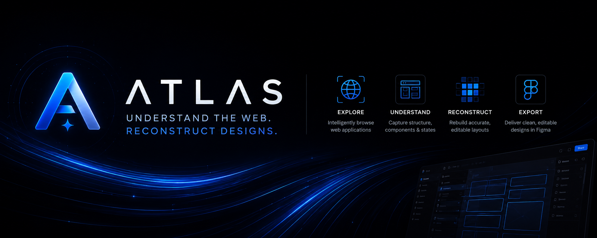
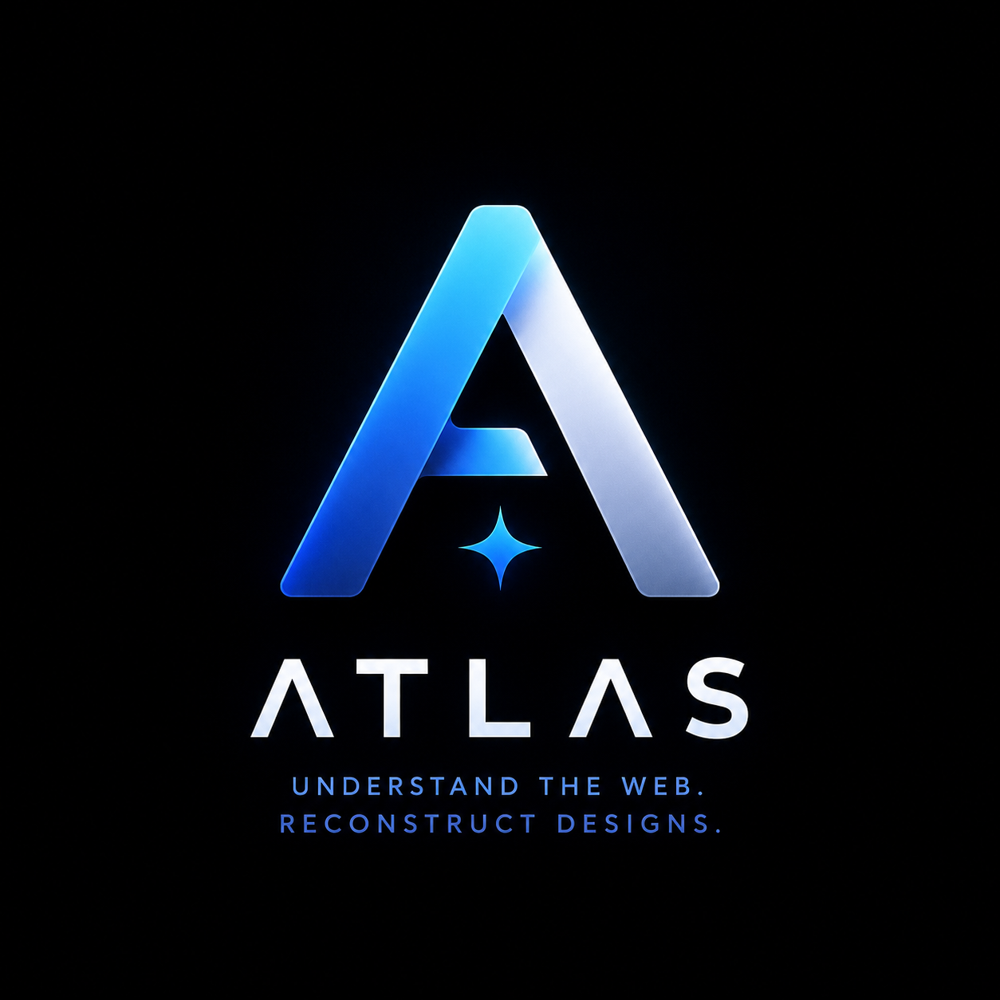

# Atlas



## Turn the web into editable design work

Atlas helps designers and teams transform live web interfaces into editable Figma designs.

Instead of starting from a flat screenshot, Atlas gives you a structured starting point you can explore, refine, and continue building from.

## Built for real product interfaces

Atlas is focused on the kinds of websites teams work with every day:

- dashboards and analytics products;
- healthcare and operations portals;
- admin panels and internal tools;
- SaaS applications;
- content-rich product experiences;
- multi-page interfaces with meaningful UI states.

## What you get

Atlas is designed to preserve the important parts of an interface:

- editable text;
- recognizable layout and hierarchy;
- reusable-looking containers and controls;
- visual details such as imagery, icons, and styling;
- alternate pages and interface states where they can be discovered.

The result is a Figma canvas you can inspect and work with—not merely a picture placed inside a frame.

## How Atlas Works

Atlas turns a live web experience into editable design work through a simple pipeline:

```text
URL
  ↓
Discover navigation
  ↓
Explore pages
  ↓
Capture interface states
  ↓
Convert
  ↓
Validate
  ↓
Import to Figma
```

The goal is a faithful, editable starting point that feels like the original product—not a flat screenshot.

**Atlas intelligently explores applications before reconstructing them, preserving structure instead of merely capturing pixels.**

## Brand

Atlas is represented by a luminous blue “A” and a four-part product story: **Explore, Understand, Reconstruct, Deliver**. “Deliver” means importing the validated reconstruction into Figma as editable design work.

| Logo | Launch profile |
| --- | --- |
|  | [View the Atlas launch profile snapshot](assets/brand/atlas-social-profile.png) |

## Why Atlas

Rebuilding a website in Figma by hand is slow. Importing a screenshot is fast, but it leaves you with very little to edit.

Atlas sits between those two extremes: it accelerates the first mile while keeping the result useful for design exploration, documentation, redesign, and handoff.

## Current direction

Atlas is being developed around a simple ambition:

> Make high-quality web interfaces easier to bring into the design process.

The current private milestone is `v0.4.0`. The system is being tested first on structured public web applications, with broader website coverage and longer-running workflows planned over time.

## Public showcase

This repository shares the product vision, capabilities, and direction of Atlas. The implementation remains private.

It intentionally does not contain source code, private URLs, credentials, customer data, or internal implementation details.

See the [product overview](docs/product-overview.md), [roadmap](docs/roadmap.md), and [limitations](docs/limitations.md) for more context.

## Status

Atlas is an active private development project.

## License

The showcase documentation is released under the MIT License. Atlas implementation code is not included and remains proprietary.

---

Powered by PMc.
